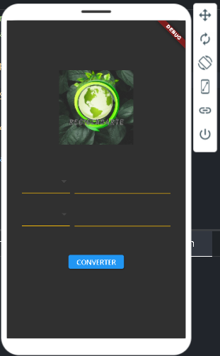
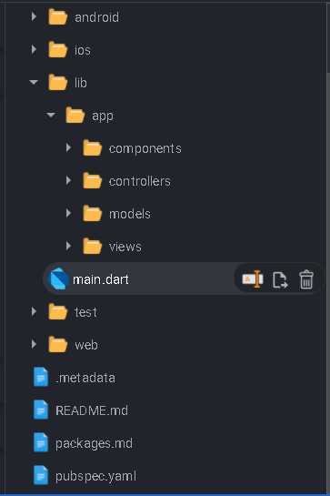
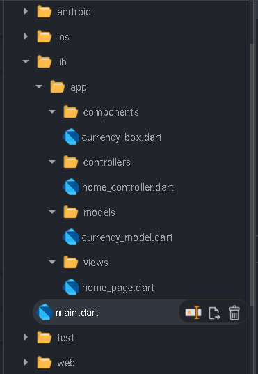

# Esta é a segunda parte do curso da player list: Curso completo de flutter

Obs: Devido a atualizações do flutter tive dificuldades ao seguir as aulas porém o que foi possível atualizei, não está completo o conversor mas este projeto pode ser usado como exemplo de arquitetura MVC para um projeto pequeno.

## Getting Started

- [Lab: Write your first Flutter app](https://flutter.dev/docs/get-started/codelab)
- [Cookbook: Useful Flutter samples](https://flutter.dev/docs/cookbook)
- [Online documentation](https://flutter.dev/docs)

- [Plataforma que utilizo para codar: FlutLab.io](https://flutlab.io)
- [Curso flutterando em questão no YouTube:](https://www.youtube.com/watch?v=XeUiJJN0vsE&list=PLlBnICoI-g-d-J57QIz6Tx5xtUDGQdBFB&ab_channel=Flutterando)

